# Ant - C++
A minimal guide on how to use **Ant** through **C++**.
## Index
- [Agent](https://github.com/LazyMarmotGames/AntDocument/blob/main/QuickStart.md#agent)
  - [Path & Movement](https://github.com/LazyMarmotGames/AntDocument/blob/main/QuickStart.md#path--movement)
    - [Path Follower Types](https://github.com/LazyMarmotGames/AntDocument/blob/main/QuickStart.md#path-follower-types)
    - [Path Replanning](https://github.com/LazyMarmotGames/AntDocument/blob/main/QuickStart.md#path-replanning)
- [Query](https://github.com/LazyMarmotGames/AntDocument/blob/main/QuickStart.md#query)
- [Debugging](https://github.com/LazyMarmotGames/AntDocument/blob/main/QuickStart.md#debugging)
- [Profiling](https://github.com/LazyMarmotGames/AntDocument/blob/main/QuickStart.md#profiling)
- [Render Integration](https://github.com/LazyMarmotGames/AntDocument/blob/main/QuickStart.md#render-integration)
- [Frequently Asked Questions](https://github.com/LazyMarmotGames/AntDocument/blob/main/QuickStart.md#frequently-Asked-questions)

 ## Agent
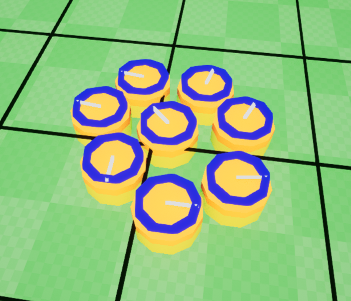

 Agents are mobile units in **Ant**. They are just simple vertical **cylinder** which can **move** and **collide** with other agents and obstacles. each agent has a bunch of properties such as **radius**, **height**, **location**, **speed** and so on. 
 
You can create an agent like this:
``` cpp
// Ant is a world subsystem. 
auto *Ant = GetWorld()->GetSubsystem<UAntSubsystem>();

// Add a new agent to the Ant.
Ant->AddAgent(AgnetLocation, AgentRadius, AgentHeight, AgentFaceAngle, AgentFlag);
```
or alter its properties right after adding it:
``` cpp
// Add a new agent to the Ant and keep its handle.
const auto AgentHandle = Ant->AddAgent(AgnetLocation, AgentRadius, AgentHeight, AgentFaceAngle, AgentFlag);

// access the agent data using its handle and change its property
Ant->GetMutableAgentData(AgentHandle).TurnRate = 0.3f;
```
**Note:** each object inside **Ant** has e **unique handle** and you should keep it somewhere for later access.

Removing an agent is as easy as adding it:
``` cpp
// Remove an agent by its handle
Ant->RemoveAgent(AgentHandle);
```
### Path & Movement
As we said, agents are mobile units so we can move them! to move an agent we have several choices, first and simplest of which is moving by **preferred velocity** like this:
``` cpp
// Move an agent by the given velocity
Ant->GetMutableAgentData(AgentHandle).PreferredVelocity = {10.f, 0.f, 0.0f};
```
For higher-level scenarios we can use a **path** which is simply an array of consecutive **portals** to move the agents. to create a path there are several ways:
```cpp
// Create a permanent shared path by given locations.
const auto Path = UAntUtil::CreateSharedPath(GetWorld(), StartLocation, EndLocation, 300);

// Create a permanent shared path by Spline.
const auto Path = UAntUtil::CreateSharedPathBySpline(GetWorld(), SplineComponent, 300);
```
**Note:** shared paths are **permanent** paths and must be removed at a later time with a direct call to `Ant->RemovePath()`.
 
 We assume we have e nice **path** and lets see how to move an agent through the path. its easy!
``` cpp
// move the agent toward the path
Ant->MoveAgentByPath(AgentHandle, Path, EAntPathFollowerType::FlowField, 10, 0, 70);
```
Yo can also move agents with a single function call (These functions automatically create and destroy the path for you):
```cpp
// Move agents to the given locations.
// This function is very efficient when used with multiple agents. it can process them in parallel.
UAntUtil::MoveAgentsToLocations(GetWorld(), AgentHandle, Location, 10, 0, 70, EAntPathFollowerType::FlowField, 300);
```
To handle and get notify about movement events just make sure you bind to each of this delegates:
 ``` cpp
// Will be called whenever an agent reached its target location.
FOnAntEvents OnMovementGoalReached;

// Will be called whenever an agent reached its missing velocity threshold.
FOnAntEvents OnMovementMissingVelocity;

// Will be called whenever an in-progress movement get canceled by user itself or whenever its followee agent is not valid anymore.
FOnAntEvents OnMovementCanceled;
```
Agents can also follow each-other but there is no path finding or obstacle avoidance this way. check`CircleSurvivors`sample for more info:
 ``` cpp
// follow another agent
Ant->FollowAgent(FollowerAgentHandle, FolloweeAgentHandle, MaxSpeed, FolloweeRadius);
```
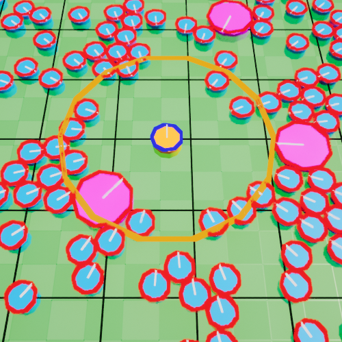

some of the movement properties are editable during movement such as **MaxSpeed** or **TargetRadius**. just make sure there is a valid in-progress movement on the agent.
``` cpp
// edit movement data of the given agent.
if (Ant->IsValidMovement(AgentHandle))
	Ant->GetMutableAgentMovement(AgentHandle).TargetRadius = 30;
```
or cancel/remove an in-progress movement:
``` cpp
// cancel the movement
Ant->RemoveAgentMovement(AgentHandle);
```
### Path Follower Types
There are different ways to move an agent along a path. in **Ant** we define it through `EAntPathFollowerType`. at the there are two types of path follower:

**1- Waypoint**

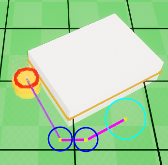

This type is useful when you need the agent to move exactly in a linear path.
 - **Red** circle is the **agent**
 - **Blue** circles are the **path points**
 - **Cyan** circle is the **target** with its radius
 - **Purple** line is the **path**

**2- Flowfield**

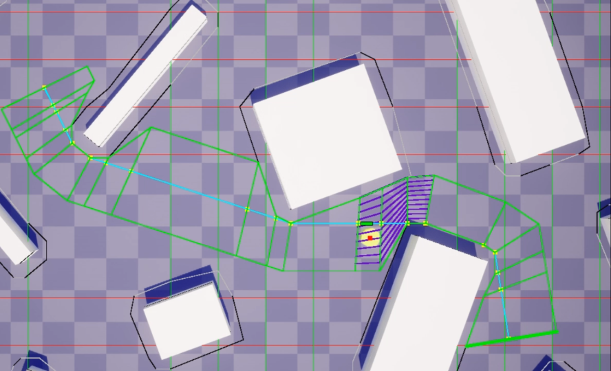
 
This type is useful when you need a wider path and your agent can be anywhere along that path. there is also a comparison [video here](https://www.youtube.com/watch?v=Oi7KzYUVXMk).

### Path Replanning
**Ant** keeps track of paths in case of **dynamic blocking obstacles**, so whenever a dynamic obstacle blocks a path, **Ant** detects it and **re-plans** the path automatically. to enable this feature:

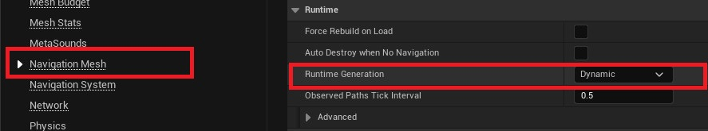
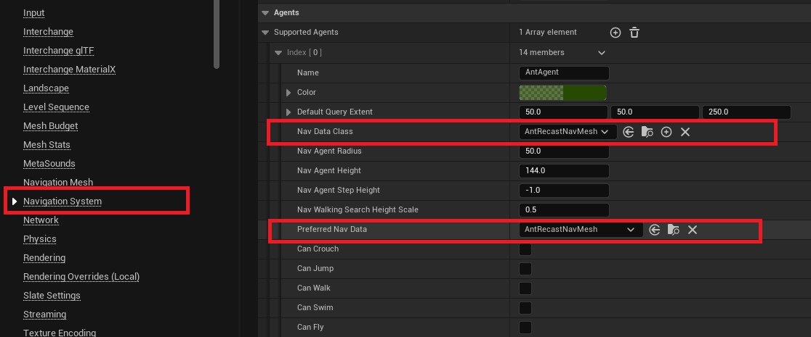

#### Notes:
 - Adding/Removing agents are very optimized in **Ant**, so don't
   worry about add or remove a bunch of them in a single frame!
 - Agents will go to **sleep** whenever there is no active movement or
   collision. **sleep/idle** agents have very little CPU overhead.
 - Most of the collision and movement algorithms are implemented
   **multi-threaded** and are **parallel**, this way **Ant** is able to utilize CPU power to handle a **large number** of the agents on gaming CPUs.

## Query


Finding enemies around towers, attacking close units or even selecting units on the screen are all uses of the **query**. **Ant** uses a **grid** as its underlying spatial partitioning system. queries are all proceed through this grid.
There are a plenty of modes which are supported for queries. also an **asynchronous** version is available which works best when you have a large number of query per frame!
**Synchronous** queries will give you the result just right after calling:
``` cpp
// Ant is a world subsystem. 
auto *Ant = GetWorld()->GetSubsystem<UAntSubsystem>();

// 
TArray<FAntContactInfo> QueryResult;
Ant->QueryCylinder(CylinderCenter, CylinderRadius, CylinderHeight, Flags, QueryResult);

// iterate over query result
for (const auto &ContactInfo : QueryResult)
	// TODO
```
Result of the asynchronous versions will be ready at the next frame:
 ``` cpp
// we can query close enemies around our hero by attach a point query on its agent
// we can also use normal query but async queries are much more efficent
EnemyQuery = Ant->QueryCylinderAttachedAsync(HeroAgentHandle, AttackRange, AttackHeight, EnemyFlag, AttackCooldown);

// bind for query result
Ant->OnQueryFinished.AddUObject(this, &ACircleSurvivors::OnEnemyInRange);
```

**Note:** What you get as an asynchronous query result is query handle itself, not the contacts. so first you need to get the query data then extract the contacts from it:
``` cpp
// listen for EnemyQuery
for (const auto &handle : HandleList)
{
	// get query result
	auto &queryResult = antSubsysem->GetAsyncQueryData(handle).Result;

	// iterate over contacts
	for (const auto &it : queryResult)
		// TODO
}
```

## Debugging
For **debugging** purpose there is a built-in `Ant.DebugDraw` command with a number parameter between **0 to 4** to visualize what's going on! 

## Profiling
Thorough `stat Ant`, you are able to see some useful stats at runtime. 

## Render Integration
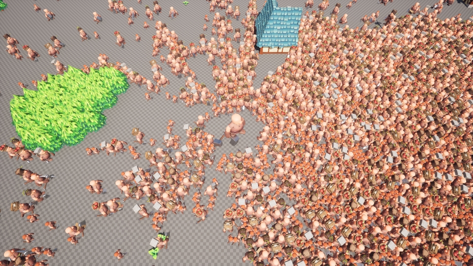

**Ant** is able to integrate with any form of rendering. if you need to render a large number (+100) of the agents with animations, UE's Skeletal mesh component won't help you much because of its poor performance! there are other options such as `Instanced Static Mesh Component` (which we used in our samples) or  even`Niagara`.
``` cpp
// setup ISMC
void ARTSUnits::SetupInstancedMeshComp()
{
	// initialize instanced static mesh components
	InstancedMeshComp = NewObject<UInstancedStaticMeshComponent>();
	InstancedMeshComp->RegisterComponentWithWorld(GetWorld());
	InstancedMeshComp->SetCollisionEnabled(ECollisionEnabled::NoCollision);
	InstancedMeshComp->SetStaticMesh(UnitMesh);
}
```
then in the `Tick()` function you can render the agents
``` cpp 
void ARTSUnits::RenderUnits()
{
	// Ant is a world subsystem
	auto *antSubsysem = GetWorld()->GetSubsystem<UAntSubsystem>();

	// clear all instances
	InstancedMeshComp->ClearInstances();

	// iterate over agents
	for (const auto &agent : antSubsysem->GetUnderlyingAgentsList())
	{
		const FVector center(agent.GetLocationLerped());
		InstancedMeshComp->AddInstance(FTransform(FRotator::ZeroRotator, center, FVector::One()));
	}
}
```

## Frequently Asked Questions
### Q- What is **[Acceleration \ Deceleration](https://en.wikipedia.org/wiki/Acceleration)** and how is it used in Ant?

**A**- **[Acceleration](https://en.wikipedia.org/wiki/Acceleration)** is the [rate](https://en.wikipedia.org/wiki/Rate_(mathematics) "Rate (mathematics)") of change of the [velocity](https://en.wikipedia.org/wiki/Velocity "Velocity") of an object with respect to time.  whenever you move an agent through a path, there are 3 parameters that determine how fast the agent moves and how fast it stops at the end of the path.

**(MaxSpeed, Acceleration, Deceleration)**

 If they are adjusted correctly, the result is a smooth movement. we assume that we have such values:
- MaxSpeed: 20
- Acceleration: 10
- Deceleration: 10
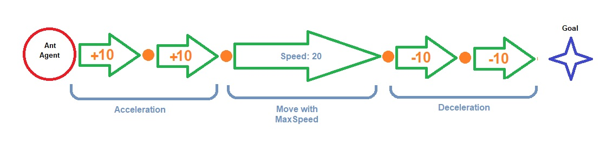

**Note:** **Acceleration/Deceleration** should always be equal to or less than **MaxSpeed**.

### Q- I can't find Ant World Settings!?

**A**-
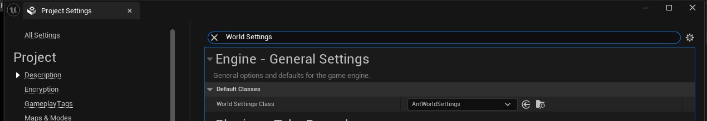 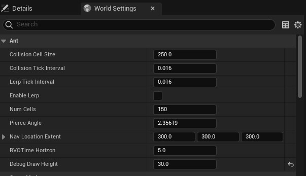

### Q- Is the example project also available in Blueprints?

**A**- Yes!

### Q- Is there an agent.GetRotation() for setting mesh instances?

**A**-
``` cpp
// current agent face angle (radian)
Ant->GetAgentData(AgentHandle).FaceAngle;

// final (target) agent face angle (radian)
// agent will interpolate from current FaceAngle to this value by TurnRate
Ant->GetAgentData(AgentHandle).FinalFaceAngle;
```

### Q- What about piercing? How exactly does that work? I can't see much differente enabling it?

**A**- This prevents agents from getting stuck in narrow entrances. If the angle is equal or greater than to the pierce angle, the agent ignore collision and penetrates. If you do not have such conditions in your map, it is better to disable it. 
``` cpp
uint8 bCanPierce : 1;
```
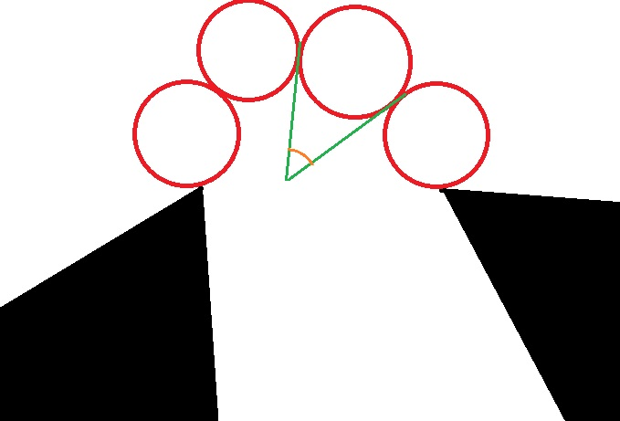

### Q- Is it possible for an agent to find the nearest agent to itself without having to check the distance to all other agents? What would be the most efficient way to do this in terms of performance?

**A**- squared distance of all queried agents is stored in FAntContactInfo::SqDist, you just need to find the smallest one from the result array.
``` cpp
MinSqDist = Results[0].SqDist;
MinSqDistIdx = 0;
for (...)
  if (Results[idx] < MinSqDist)
    { MinSqDist = Results[0].SqDist; MinSqDistIdx = idx;}
```

### Q- How do I deactivate the collision between agents?

**A**- Each agent has two types of flags for collision manipulation.
``` cpp 
// 1- Agent flag (self)
int32 Flag;
// Access
Ant->GetAgentFlag(AgentHandle);
Ant->SetAgentFlag(AgentHandle);


// 2- Ignoring other agents by this flag.
int32 IgnoreFlag = 0;
// Access
Ant->GetAgentData(AgentHandle).IgnoreFlag;
```
Both are bit-field values. for example, suppose we have two types of units and we want to ignore the first type by the second type:
``` cpp 
const auto UnitFlagType_1 = 1 << 0;
const auto UnitFlagType_2 = 1 << 1;

// Setting the first type unit flag
Ant->SetAgentFlag(FirstAgentHandle, UnitFlagType_1);

// Setting the second type unit flag
Ant->SetAgentFlag(SecondAgentHandle, UnitFlagType_2);

// ignore UnitFlagType_2 by UnitFlagType_1 
Ant->GetAgentData(FirstAgentHandle).IgnoreFlag = UnitFlagType_2;
```
This is a well-known method in most physics libraries for handling collisions, and with the right value at the right time, it can even handle complex situations.
