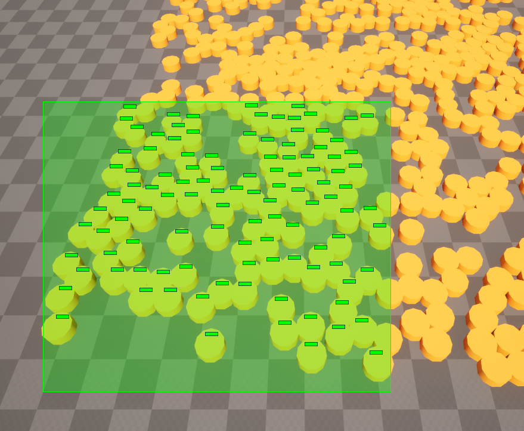

# Ant - Quick Start Guide (C++)
There are **three main concept** in the **Ant**.

 ## 1- Agent


 Agents are mobile units in the **Ant**. They are just simple **circles** which can **move** or **collide** with other agents and obstacles. each agent has a bunch of properties such as **radius**, **location**, **speed** and so on. 
 
You can create an agent like this:
``` cpp
// Ant is a world subsystem. 
auto *Ant = GetWorld()->GetSubsystem<UAntSubsystem>();

// Add a new agent to the Ant.
Ant->AddAgent(AgnetLocation, AgentRadius, AgentFaceAngle, AgentFlag);
```
or alter its properties right after adding it:
``` cpp
// Add a new agent to the Ant and keep its handle.
const auto AgentHandle = Ant->AddAgent(AgnetLocation, AgentRadius, AgentFaceAngle, AgentFlag);

// access the agent data using its handle and change its property
Ant->GetMutableAgentData(AgentHandle).TurnRate = 0.3f;
```
**Note:** each object inside the Ant has e **unique handle** and you should keep it somewhere for later access.

Removing an agent is easy as adding it:
``` cpp
// Remove an agent by its handle
Ant->RemoveAgent(AgentHandle);
```
### Movement
As we said, agents are mobile units so we can move them! to move an agent we have several choices, first and simplest of which is moving by **preferred velocity** like this:
``` cpp
// Move an agent by the given velocity
Ant->GetMutableAgentData(AgentHandle).PreferredVelocity = {10.f, 0.f};
```
For higher-level scenarios we can use a **path** which is simply an array of consecutive points. to find a path from a location to another location we have several choices. if you are  using UE's default navigation system, you can query the path by `UNavigationSystem`. there are some sample code about this inside the `RTSUnits` sample. 
We assume we have e nice path and lets see how to move an agent through the path. its easy!
``` cpp
// move the agent toward the path
Ant->MoveAgentTo(AgentHandle, PathPoints, MaxSpeed, TargetRadius, PathPointsRadius);
```


 - **Red** circle is the **agent**
 - **Blue** circles are the **path points**
 - **Cyan** circle is the **target** with its radius
 - **Purple** line is the **path**

To handle and get notify about movement events just make sure you bind to each of this delegates:
 ``` cpp
// Will be called whenever an agent reached its target location.
FOnAntEvents OnMovementGoalReached;

// Will be called whenever an agent reached its missing velocity threshold.
FOnAntEvents OnMovementMissingVelocity;

// Will be called whenever an in-progress movement get canceled by user itself or whenever its followee agent is not valid anymore.
FOnAntEvents OnMovementCanceled;
```
Agents can also follow each-other but there is no path finding or collision avoidance this way. check`CircleSurvivors`sample for more info:
 ``` cpp
// follow another agent
Ant->FollowAgent(FollowerAgentHandle, FolloweeAgentHandle, MaxSpeed, FolloweeRadius);
```


some of the movement properties are editable during movement such as **MaxSpeed** or **TargetRadius**. just make sure there is an in-progress movement on the agent.
``` cpp
// edit movement data of the given agent.
if (Ant->IsValidMovement(AgentHandle))
	Ant->GetMutableAgentMovement(AgentHandle).TargetRadius = 30;
```
or cancel/remove an in-progress movement:
``` cpp
// cancel the movement
Ant->RemoveAgentMovement(AgentHandle);
```
**Ant** also supports **corridor**! to move the agents along a **corridor** we have to prepare some data beforehand such as **path portals** and **portal alpha** per agent. we also utilize `NavCorridor` plugin during the process.
``` cpp
// Get lerp alpha used by the path portals
void GetCorridorPortalAlpha(const TArray<FVector> &SourceLocations, const FVector &DestLocation, TArray<float> &ResultAlpha);

// Adjust raw path by the given portals
void AdjustPathByPortal(const TArray<FNavCorridorPortal> &Portals, float PortalAlpha, TArray<FVector> &ResultPath);
```


For a working sample check `RTSUnits`.
If you have a big flat map without any obstacle and corridor, you can fully ignore this feature.
#### Notes:
 - Adding/Removing agents are very optimized in the **Ant**, so don't
   worry about add or remove a bunch of them in a single frame!
 - Agents will go to **sleep** whenever there is no active movement or
   collision. **sleep/idle** agents have very little CPU overhead.
 - Most of the collision and movement algorithms are implemented
   **multi-threaded** and are **parallel**, this way **Ant** is able to utilize CPU power and handle a **large number** of the agents on gaming CPUs.

## 2- Obstacle


An **obstacle** is an array of **line segments**. they are **static/stationary** units in the **Ant**. their main task is to prevent the agents from passing trough. walls, doors, buildings are all examples of obstacles.
You can create an obstacle like this:
``` cpp
// Ant is a world subsystem. 
auto *Ant = GetWorld()->GetSubsystem<UAntSubsystem>();

// Add a new obstacle to the Ant.
Ant->AddObstacle(SegmentStart, SegmentEnd, Flags);
```
There are a bunch of overload for this function to adding more complex shapes such as polygons. 
You can also remove an obstacle just like agents:
``` cpp
// Remove an obstacle by its handle
Ant->RemoveObstacle(ObstacleHandle);
```
#### Notes:
 - Adding/Removing obstacles are very optimized in the **Ant**, so don't
   worry about add or remove a bunch of them in a single frame!
  - An obstacle in any form and shape is not a **solid shape**. they are just **line segments**.

## 3- Query

Finding enemies around towers, attacking close units or even selecting units on the screen are all uses of the **query**. **Ant** uses a **grid** as its underlying spatial partitioning system.  queries are all proceed through this grid.
There are a plenty of shapes which are supported for queries. also an **asynchronous** version is available which works best when you have a large number of query per frame!
**Synchronous** queries will give you the result just right after calling:
``` cpp
// Ant is a world subsystem. 
auto *Ant = GetWorld()->GetSubsystem<UAntSubsystem>();

// 
TArray<FAntContactInfo> QueryResult;
Ant->QueryPoint(QueryCenter, QueryRadius, Flags, QueryResult);

// iterate over query result
for (const auto &ContactInfo : QueryResult)
	// TODO
```
Result of the asynchronous versions will be ready at the next frame:
 ``` cpp
// we can query close enemies around our hero by attach a point query on its agent
// we can also use normal query but async queries are much more efficent
EnemyQuery = Ant->QueryPointAttachedAsync(HeroAgentHandle, AttackRange, EnemyFlag, AttackCooldown);

// bind for query result
Ant->OnQueryFinished.AddUObject(this, &ACircleSurvivors::OnEnemyInRange);
```
